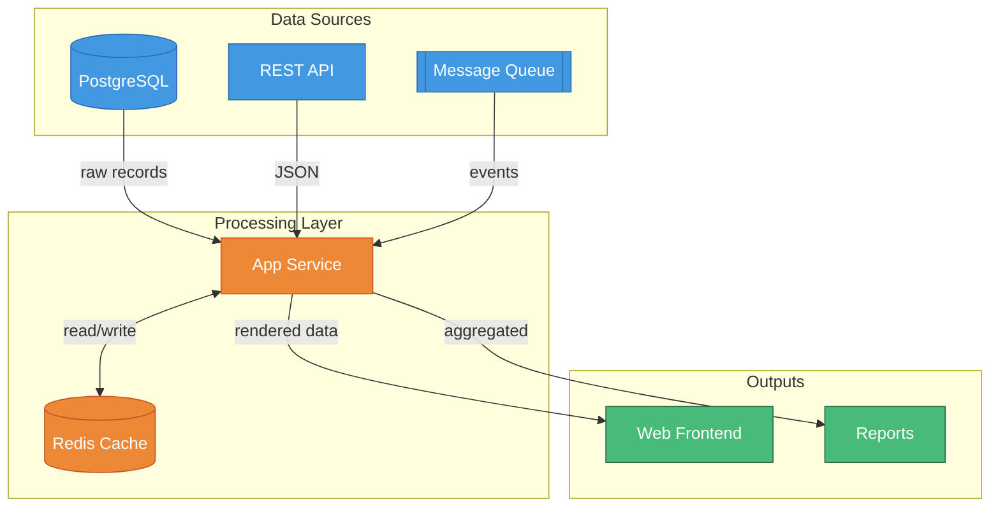
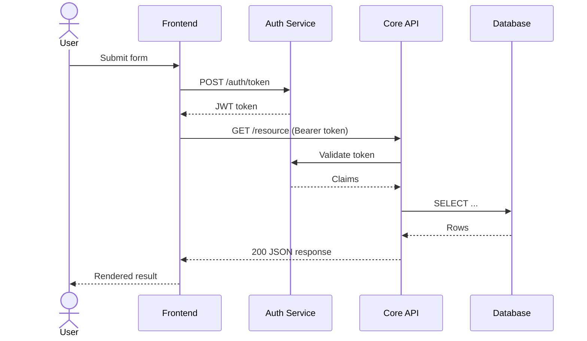
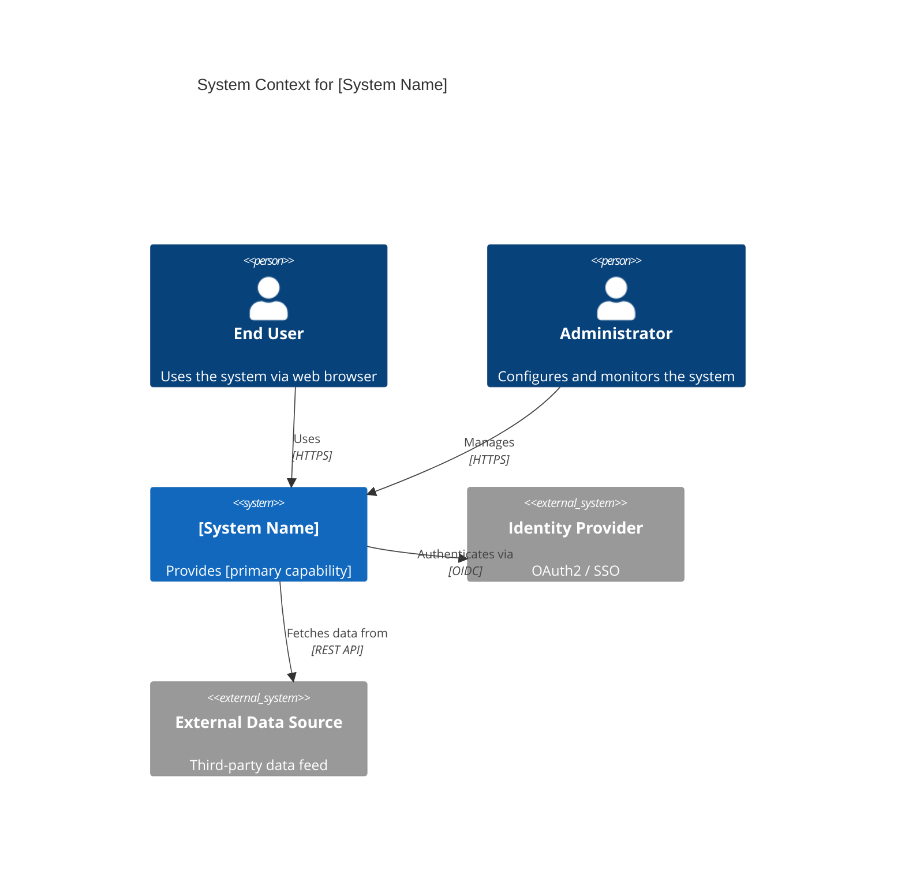
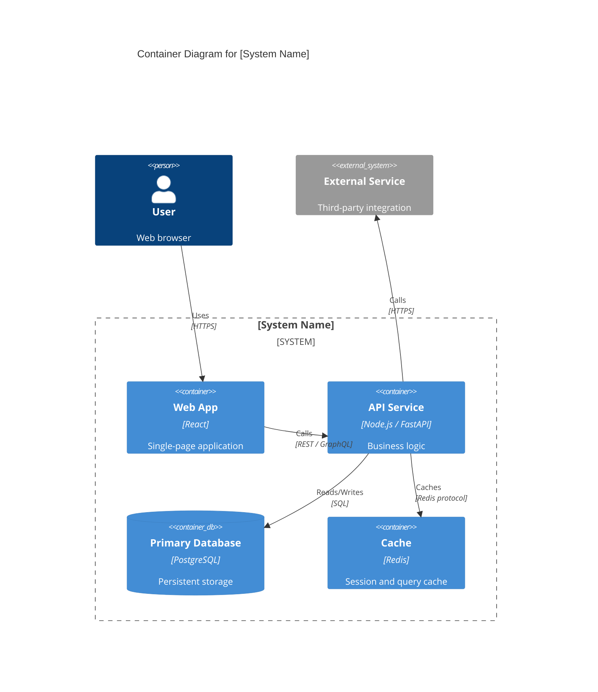
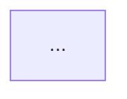

# Mermaid Architecture Diagrams

**Goal**: Produce valid Mermaid diagram syntax for embedding in Markdown files, GitHub READMEs,
wikis, or any renderer that supports Mermaid (Notion, Obsidian, GitLab, etc.).

## Prerequisites

- [ ] Diagram type selected (graph, sequence, C4Context, C4Container)
- [ ] Components/nodes identified
- [ ] Edges and data flow direction mapped
- [ ] Styling approach chosen (classDef or default)

---

## Diagram Type Selection

### `graph TD` / `graph LR` — Component & Data Flow

Use for: service maps, data pipelines, dependency graphs.



### `sequenceDiagram` — Service-to-Service Call Flows

Use for: API request/response chains, auth flows, event handling.



### `C4Context` — System Context Diagram

Use for: top-level view showing people, systems, and boundaries. Requires Mermaid v10.3+.



### `C4Container` — Container-Level Diagram

Use for: services/databases/frontends within a single system.



---

## Node Shape Reference (`graph` diagrams)

| Shape | Syntax | Semantic Use |
|-------|--------|-------------|
| Rectangle | `A[Label]` | Service, application |
| Rounded rect | `A(Label)` | Process, step |
| Stadium | `A([Label])` | Start/end |
| Cylinder | `A[(Label)]` | Database, storage |
| Double bracket | `A[[Label]]` | Queue, buffer |
| Diamond | `A{Label}` | Decision, condition |
| Hexagon | `A{{Label}}` | Preparation |
| Parallelogram | `A[/Label/]` | Input/output |

---

## Styling with `classDef`

Always apply semantic color classes rather than per-node styles:

```
classDef source  fill:#4299e1,stroke:#2b6cb0,color:#fff,rx:6
classDef proc    fill:#ed8936,stroke:#c05621,color:#fff,rx:6
classDef ai      fill:#9f7aea,stroke:#6b46c1,color:#fff,rx:6
classDef output  fill:#48bb78,stroke:#276749,color:#fff,rx:6
classDef error   fill:#e53e3e,stroke:#c53030,color:#fff,rx:6
classDef neutral fill:#718096,stroke:#4a5568,color:#fff,rx:6
```

Then: `class NodeA,NodeB source` to apply.

---

## Output Format

Always output a fenced code block with the `mermaid` language tag:

````

````

Do **not** save a file unless the user explicitly asks for a `.mmd` file.

---

## Validation Gate

Before outputting:
- [ ] Diagram renders without syntax errors (review for unclosed brackets, invalid arrows)
- [ ] All nodes use a semantic `classDef` class
- [ ] Subgraph labels are meaningful (not `subgraph A`)
- [ ] Edge labels describe what flows (not just unlabeled `-->`)
- [ ] Diagram type matches the request (component map ≠ sequence diagram)
- [ ] No placeholder text in node labels

## Common Issues

- **Mermaid version gate**: `C4Context`/`C4Container` require Mermaid v10.3+. If the user's renderer is older, fall back to `graph TD` with subgraphs.
- **Too many nodes**: Mermaid struggles above ~30 nodes — split into multiple diagrams.
- **Special characters in labels**: Wrap in `"quotes"` if the label contains parentheses, colons, or slashes.
- **Circular dependencies**: Mermaid renders cycles but they can look confusing — note them with a comment.
