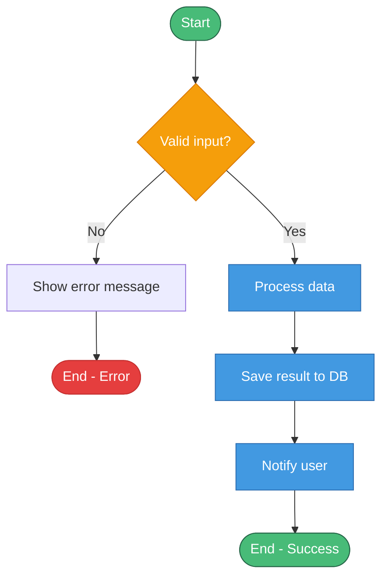
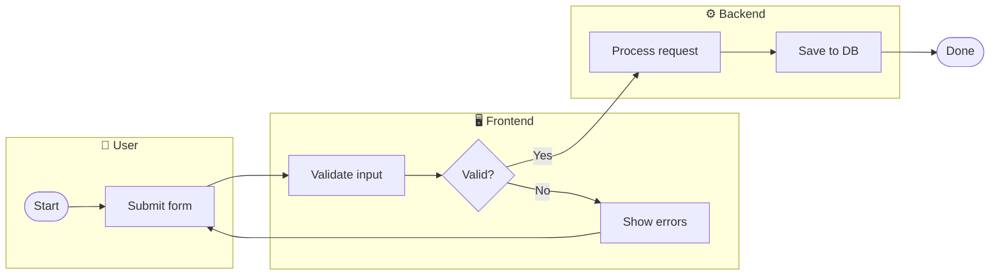
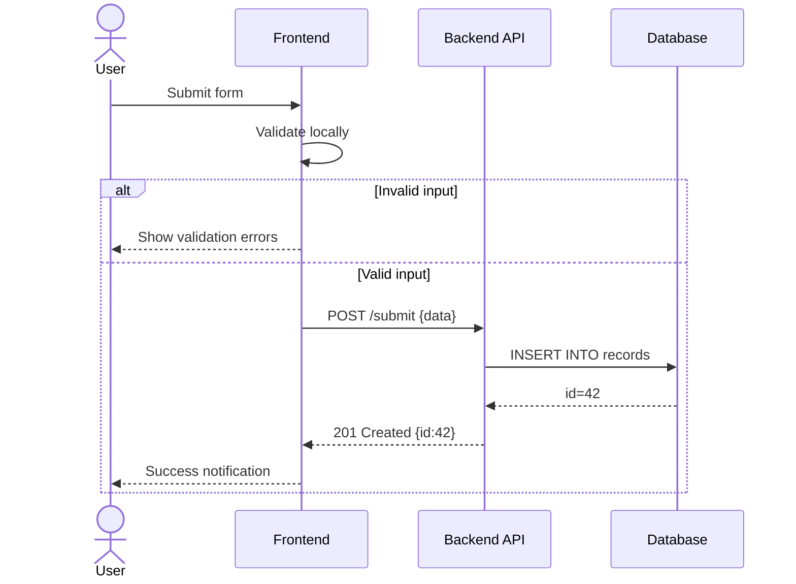
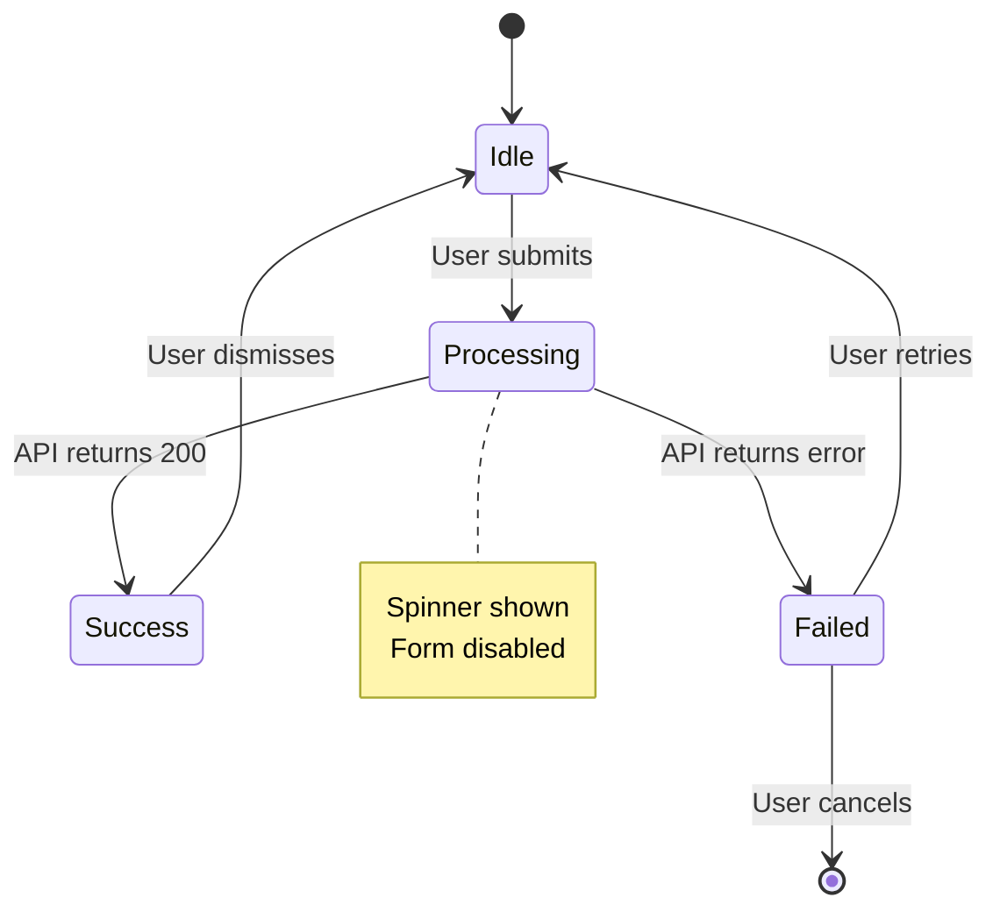
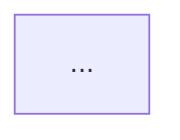

# Mermaid Flowcharts

**Goal**: Valid Mermaid syntax for flowcharts, decision trees, state machines, and sequence diagrams
that embed cleanly in Markdown files, GitHub, GitLab, Notion, and Obsidian.

## Prerequisites

- [ ] Diagram type selected (flowchart, sequenceDiagram, stateDiagram-v2)
- [ ] All steps, decisions, and branches mapped
- [ ] Swim lanes / actors identified (if applicable)

---

## Diagram Type Selection

### `flowchart TD/LR` — Process Flows & Decision Trees

Default for most flowchart requests. `TD` = top-down, `LR` = left-right.



### `flowchart` with Swim Lanes (subgraphs as actors)



### `sequenceDiagram` — Step-by-Step Interactions

Use when the flow involves multiple systems calling each other (API calls, events, async responses).



### `stateDiagram-v2` — State Machines

Use when documenting states and transitions (order lifecycle, auth state, UI state machine).



---

## Node Shape Quick Reference (`flowchart`)

| Shape | Syntax | Use |
|-------|--------|-----|
| Stadium (pill) | `A([Label])` | Start / End |
| Rectangle | `A[Label]` | Process step |
| Diamond | `A{Label}` | Decision |
| Rounded rect | `A(Label)` | Subprocess |
| Parallelogram | `A[/Label/]` | I/O |
| Circle | `A((Label))` | Connector / join |
| Hexagon | `A{{Label}}` | Preparation |

---

## Styling with `classDef`

Always define semantic classes and apply them to nodes:

```
flowchart TD
    classDef start   fill:#48bb78,stroke:#276749,color:#fff
    classDef proc    fill:#4299e1,stroke:#2b6cb0,color:#fff
    classDef dec     fill:#f59e0b,stroke:#d97706,color:#fff
    classDef term    fill:#e53e3e,stroke:#c53030,color:#fff
    classDef ext     fill:#9f7aea,stroke:#6b46c1,color:#fff

    class StartNode start
    class StepA,StepB proc
    class DecisionX dec
```

---

## Edge / Arrow Variants

```
A --> B          % Default solid arrow
A --- B          % Line, no arrowhead
A -. label .-> B % Dashed arrow
A == label ==> B % Thick arrow (critical path)
A -- label --> B % Solid with label
A -- Yes --> B   % Decision branch label
A -- No  --> C
```

---

## Output Format

Always wrap in a fenced code block with `mermaid` language tag:

````

````

Do **not** save a file unless the user explicitly asks for a `.mmd` file.

---

## Validation Gate

Before outputting:
- [ ] All decision nodes have at least two labeled exits
- [ ] All paths reach a terminal node (`([End])` or `[*]`)
- [ ] `classDef` applied to all nodes (no unstyled nodes)
- [ ] No special characters in node IDs (use alphanumeric + underscore only)
- [ ] Diagram type matches the request (don't use `sequenceDiagram` for a decision tree)
- [ ] No placeholder labels in the output

## Common Issues

- **Node ID conflicts**: IDs must be unique within the diagram — `A[Step A]` and `A[Step B]` is invalid
- **Special chars in labels**: Wrap labels in `"quotes"` if they contain `()`, `{}`, `[]`, `:`, `>`
- **Too many nodes**: Mermaid struggles above ~25 nodes — split into sub-diagrams
- **Swim lane edges**: In `flowchart LR` with subgraphs, edges between subgraphs must be declared outside all subgraph blocks
- **`stateDiagram-v2` vs `stateDiagram`**: Always use `stateDiagram-v2` — the v1 syntax is deprecated
